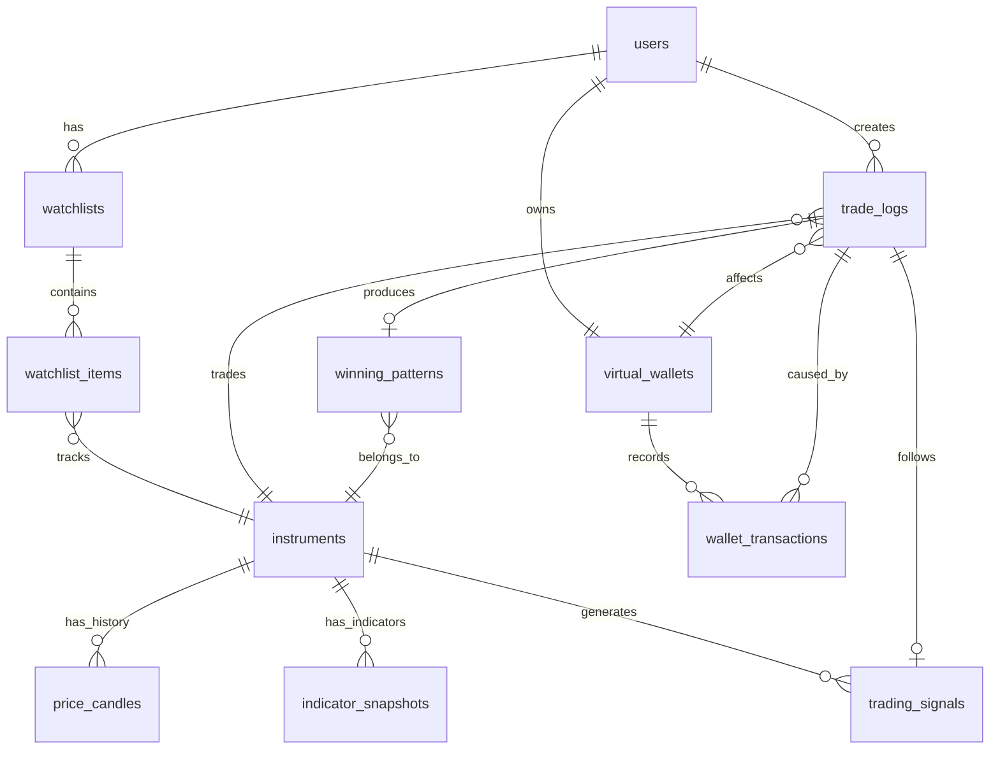

# Phân tích chuyên sâu Kiến trúc Database - Trading Signal Platform

Tài liệu này đi sâu vào việc phân tích, thiết kế và các kỹ thuật tối ưu hóa cho cơ sở dữ liệu của hệ thống **Signal Research & Backtesting Platform**.

## 1. Sơ đồ thực thể liên kết (ERD)

---

## 2. Phân tích chi tiết từng bảng (Tables)

### 2.1. Nhóm cấu hình và người dùng

#### Bảng `users`
- **Chức năng:** Quản lý thông tin đăng nhập và phân quyền.
- **Phân tích kỹ thuật:**
  - `id`: `BIGINT` tự tăng hoặc `UUID`. Dùng `BIGINT` sẽ cho hiệu năng index tốt hơn.
  - `password_hash`: Bắt buộc dùng thuật toán băm chậm như BCrypt/Argon2.
- **Rủi ro/Lưu ý:** Cần có index trên `email` vì thường xuyên dùng để query khi đăng nhập.

#### Bảng `instruments` (Mã giao dịch)
- **Chức năng:** Lưu trữ danh mục các mã tài sản (Crypto, Stock) mà hệ thống đang theo dõi.
- **Phân tích kỹ thuật:**
  - `symbol` (VD: `BTCUSDT`): `VARCHAR(20) UNIQUE`. Cần UNIQUE index để tránh duplicate.
  - `is_active`: `BOOLEAN`. Dùng để bật/tắt luồng lấy dữ liệu (Data Collector) cho một mã cụ thể để tiết kiệm tài nguyên.

---

### 2.2. Nhóm dữ liệu chuỗi thời gian (Time-Series Data) - Bảng siêu lớn

#### Bảng `price_candles` (Dữ liệu nến)
- **Chức năng:** Lưu trữ giá mở, cao, thấp, đóng (OHLC) và khối lượng. Là trái tim của hệ thống.
- **Phân tích kỹ thuật:**
  - **Kiểu dữ liệu:** OHLCV tuyệt đối phải dùng `DECIMAL(18,8)` (đặc biệt trong Crypto vì giá trị coin có thể rất nhỏ như SHIB). Dùng `FLOAT` hay `DOUBLE` sẽ dẫn đến lỗi làm tròn dấu phẩy động (Floating-point precision loss), phá hỏng hoàn toàn công thức tính indicator sau này.
  - **Unique Constraint:** `UNIQUE(instrument_id, timeframe, open_time)`. Tránh tình trạng duplicate dữ liệu khi Data Collector chạy lại (ví dụ retry sau khi fail). Khi Insert có thể kết hợp `ON CONFLICT DO UPDATE`.
  - **Composite Index (Chỉ mục phức hợp):** `(instrument_id, timeframe, open_time DESC)`. 
    - *Lý do:* Mọi query lấy dữ liệu nến đều theo pattern: Lấy nến của mã X, khung thời gian Y, từ thời điểm Z trở về trước. 
    - Chiều `DESC` giúp tối ưu khi phân trang (Keyset pagination) để lấy nến lùi về quá khứ.

#### Bảng `indicator_snapshots`
- **Chức năng:** Caching lại giá trị các chỉ báo (RSI, MA, MACD) tương ứng với từng cây nến.
- **Phân tích kỹ thuật:**
  - **Trade-off (Đánh đổi):** Việc lưu sẵn giúp giảm tải CPU khổng lồ khi user mở chart hoặc chạy backtest, đổi lại sẽ tốn thêm dung lượng ổ cứng (Space-Time tradeoff).
  - **Khớp nối (Join):** Ràng buộc 1-1 logic với `price_candles` thông qua `(instrument_id, candle_time)`.
  - `volume_ratio`: Lưu trữ dưới dạng `DECIMAL(10,4)`.

---

### 2.3. Nhóm tính toán và Logic

#### Bảng `trading_signals`
- **Chức năng:** Ghi nhận mọi tín hiệu BUY/SELL mà hệ thống (Signal Engine) sinh ra.
- **Phân tích kỹ thuật:**
  - `rule_basis`: Lưu dạng **JSON/JSONB** (nếu dùng PostgreSQL). Chứa dữ kiện giải thích TẠI SAO tín hiệu này được sinh ra (VD: `{"rule":"RSI_OVERSOLD", "rsi_val":29.5}`). JSONB hỗ trợ đánh index trên thuộc tính bên trong nếu cần query sau này.
  - `confidence_score`: Điểm tự tin của tín hiệu. Rất hữu ích khi cho phép user lọc chỉ nhận tín hiệu có độ tin cậy > 80%.

#### Bảng `trade_logs`
- **Chức năng:** Nhật ký giao dịch (mô phỏng) của user.
- **Phân tích kỹ thuật:**
  - `wallet_id`: Ràng buộc giao dịch này thuộc về ví ảo nào.
  - Thiết kế `signal_id` nullable: Vì user có thể tự đánh lệnh bằng tay mà không theo tín hiệu, hoặc theo tín hiệu của hệ thống.
  - **Chống gian lận:** `entry_price` và `exit_price` tuyệt đối **không cho phép user nhập tay**, Backend service phải tự tra cứu giá từ bảng `price_candles` dựa trên timestamp lúc mở/đóng lệnh. Điều này đảm bảo pattern lưu lại phản ánh đúng thị trường thật.
  - Cần tính toán sẵn `pnl_percent` (Profit and Loss) thay vì tính on-the-fly để dễ dàng làm query thống kê báo cáo (VD: Tính win-rate).

#### Bảng `winning_patterns`
- **Chức năng:** Trái tim của tính năng "học từ lịch sử", lưu trữ cấu trúc vector của các lệnh thắng.
- **Phân tích kỹ thuật:**
  - `feature_vector`: Cột JSON. Lưu mảng/đối tượng đã được chuẩn hóa (Normalization). VD: `[0.28, 1.0, 0.5, 0.02]`.
  - **Vấn đề Performance:** Nếu lưu JSON thuần, không thể query "tìm các vector tương đồng" trực tiếp bằng SQL chuẩn một cách hiệu quả.
  - **Giải pháp:** 
    1. Load lên Java Memory và tính Cosine Similarity (phù hợp nếu dữ liệu < 100,000 dòng).
    2. Nếu dùng PostgreSQL, cài extension `pgvector` và đổi cột thành type `vector`, sử dụng index HNSW hoặc IVFFlat để truy vấn Nearest Neighbor siêu tốc ở mức Database. (Nên nói hướng 2 trong phỏng vấn để thể hiện trình độ Senior).

---

### 2.4. Nhóm Ví ảo và Giao dịch mô phỏng (Paper Trading)

#### Bảng `virtual_wallets`
- **Chức năng:** Ví tiền ảo phục vụ mô hình đánh giá thật, tiền giả (Paper Trading).
- **Phân tích kỹ thuật:**
  - `user_id`: Đánh index `UNIQUE`, hiện tại mỗi user có 1 ví (có thể mở rộng thành nhiều portfolio sau này).
  - `version`: Cột cực kỳ quan trọng dùng cho **Optimistic Locking** (`@Version` trong JPA/Hibernate). Giúp chống Race Condition khi có 2 lệnh đóng cùng lúc cố gắng cập nhật số dư, đảm bảo tính toàn vẹn dữ liệu.
  - `initial_balance`: Dùng làm cơ sở để vẽ biểu đồ tăng trưởng vốn (Equity Curve).

#### Bảng `wallet_transactions`
- **Chức năng:** Lưu lại toàn bộ lịch sử biến động số dư ví. Đây là **Source of Truth (Nguồn sự thật)** của hệ thống kế toán.
- **Phân tích kỹ thuật:**
  - Ràng buộc bất biến (Invariant): Tại bất kỳ thời điểm nào, `wallet.balance` phải BẰNG `initial_balance + SUM(wallet_transactions.amount)`. Số dư ví ở `virtual_wallets` thực chất chỉ là một bản cache/snapshot để đọc nhanh.
  - `balance_after`: Snapshot số dư sau khi giao dịch thành công. Việc lưu sẵn thông tin này giúp việc dựng biểu đồ Equity Curve cực kỳ nhẹ nhàng (không phải lấy toàn bộ log cũ để cộng dồn lại từ đầu).

---

## 3. Các chiến lược tối ưu Database (Performance Tuning)

1. **Table Partitioning (Phân mảnh bảng):**
   - Bảng `price_candles` và `indicator_snapshots` sẽ phình to rất nhanh. 1 mã crypto chạy nến 1 phút sẽ sinh ra 1,440 nến/ngày -> ~525,000 nến/năm. Nếu có 100 mã thì là 52 triệu nến/năm.
   - **Giải pháp:** Cấu hình **Range Partitioning** trên PostgreSQL theo từng tháng hoặc quý dựa trên cột `open_time`. Query sẽ tự động bỏ qua các partition không liên quan (Partition Pruning).

2. **Keyset Pagination (Phân trang bằng con trỏ):**
   - Tuyệt đối không dùng `OFFSET X LIMIT Y` trên các bảng chuỗi thời gian, vì DB phải duyệt qua X row đầu tiên rồi mới trả về Y row, gây chậm tỷ lệ thuận với số trang.
   - **Giải pháp:** `WHERE open_time < '2023-01-01' ORDER BY open_time DESC LIMIT 100`. Chỉ mất `O(1)` thời gian do tận dụng triệt để index.

3. **Chống N+1 Query trong JPA/Hibernate:**
   - Khi fetch danh sách `trade_logs`, nó sẽ tự động phát sinh query để lấy `users` và `instruments` (nếu khai báo EAGER hoặc truy cập vào thuộc tính trong vòng lặp).
   - **Giải pháp:** Dùng `@EntityGraph` trên interface Repository để ép Hibernate sinh ra 1 câu lệnh `JOIN FETCH` duy nhất.

4. **Archiving (Lưu trữ ngoại tuyến):**
   - Đối với dữ liệu nến cũ hơn 2-3 năm, có thể làm một cronjob đẩy ra các file Parquet/CSV lưu trữ trên AWS S3, và xóa khỏi PostgreSQL để giữ bảng luôn nhẹ, chỉ phục vụ data "nóng".

5. **Đảm bảo tính nhất quán dữ liệu (Data Consistency & Concurrency):**
   - **Race Condition:** Áp dụng cơ chế **Optimistic Locking** trên bảng `virtual_wallets`. Khi 2 request đồng thời cố gắng cập nhật `balance`, request thứ 2 sẽ nhận được lỗi `OptimisticLockException` và có thể retry lại hoặc báo user thay vì đè dữ liệu sai lên nhau.
   - **Tính toàn vẹn giao dịch (ACID):** Toàn bộ luồng đóng lệnh (Tính PnL -> Cập nhật balance -> Ghi nhận transaction -> Sinh winning pattern) phải nằm trọn trong 1 `@Transactional`. Rollback tuyệt đối nếu bất kỳ khâu nào báo lỗi để tránh tình trạng "sai lệch sổ sách" (như trừ tiền nhưng lệnh không ghi).
